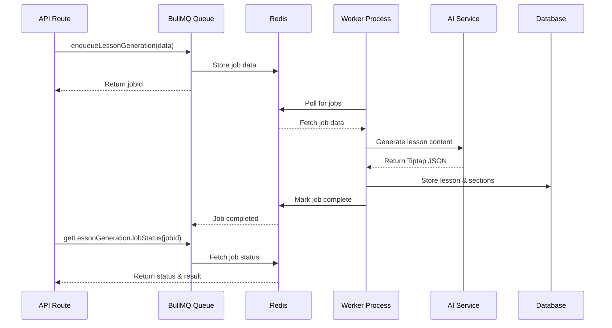

# BullMQ Job Queue System

This directory contains the BullMQ-based job queue infrastructure for async processing of AI lesson generation and other background tasks.

## Architecture

```
src/lib/queue/
├── connection.ts          # Redis connection configuration
├── queues.ts             # Queue definitions and helpers
├── workers.ts            # Worker initialization and management
├── types.ts              # TypeScript type definitions
├── jobs/
│   └── lesson-generation.ts  # Lesson generation job processor
└── README.md             # This file
```

## Quick Start

### 1. Install Redis

**Using Docker (Recommended):**
```bash
docker run -d --name redis -p 6379:6379 redis:latest
```

**Using Homebrew (macOS):**
```bash
brew install redis
brew services start redis
```

**Using apt (Ubuntu):**
```bash
sudo apt install redis-server
sudo systemctl start redis-server
```

### 2. Configure Environment

Add to your `.env` file:

```env
# Redis connection
REDIS_URL=redis://localhost:6379

# Worker settings
ENABLE_WORKERS=true
WORKER_CONCURRENCY=2
LESSON_WORKER_CONCURRENCY=2

# Required for lesson generation
DATABASE_URL=postgresql://...
OPENROUTER_API_KEY=sk-or-...
```

### 3. Run Workers

**In development:**
```bash
npm run worker:dev
```

**In production:**
```bash
npm run worker
```

## Usage

### Enqueuing Jobs

```typescript
import { enqueueLessonGeneration } from '@/lib/queue';

// Enqueue a lesson generation job
const jobId = await enqueueLessonGeneration({
  userId: 123,
  topic: 'JavaScript Closures',
  difficulty: 'standard',
  triggerSource: 'chat',
  context: 'User asked: "Explain closures in detail"',
});

console.log('Job enqueued:', jobId);
```

### Checking Job Status

```typescript
import { getLessonGenerationJobStatus } from '@/lib/queue';

const status = await getLessonGenerationJobStatus(jobId);

console.log('Job state:', status.state); // 'waiting' | 'active' | 'completed' | 'failed'
console.log('Progress:', status.progress);
console.log('Result:', status.result); // Available when completed
```

### Queue Metrics

```typescript
import { getLessonGenerationQueueMetrics } from '@/lib/queue';

const metrics = await getLessonGenerationQueueMetrics();

console.log('Queue metrics:', {
  waiting: metrics.counts.waiting,
  active: metrics.counts.active,
  completed: metrics.counts.completed,
  failed: metrics.counts.failed,
});
```

## Job Flow



## Job States

| State | Description |
|-------|-------------|
| `waiting` | Job is queued and waiting to be processed |
| `active` | Job is currently being processed by a worker |
| `completed` | Job completed successfully |
| `failed` | Job failed after all retry attempts |
| `delayed` | Job is delayed (e.g., scheduled for future) |

## Progress Tracking

Jobs emit progress updates during processing:

```typescript
// In the worker
await job.updateProgress({
  step: 'generating_sections',
  percentage: 45,
  message: 'Generating section 2/5...',
  currentSection: {
    index: 2,
    total: 5,
    title: 'Understanding Scope',
  },
});
```

## Error Handling

Jobs automatically retry on failure with exponential backoff:

- **Attempt 1**: Immediate
- **Attempt 2**: After 5 seconds
- **Attempt 3**: After 15 seconds
- **Final failure**: After 3 attempts, job moves to failed state

## Deployment

### Development

Run the worker in a separate terminal:

```bash
# Terminal 1: Next.js server
npm run dev

# Terminal 2: Worker process
npm run worker:dev
```

### Production

**Option 1: Same Server**
- Use a process manager like PM2 to run both Next.js and worker
- Not recommended for high load

**Option 2: Separate Worker Server (Recommended)**
- Deploy worker on Railway, Render, or separate VPS
- Scale workers independently from web servers
- Configure `REDIS_URL` to point to hosted Redis (Upstash, Redis Cloud)

**Example with PM2:**

```bash
# Install PM2
npm install -g pm2

# Start both processes
pm2 start npm --name "web" -- start
pm2 start npm --name "worker" -- run worker

# Monitor
pm2 logs
pm2 status
```

## Monitoring

### Queue Health

Check queue health with built-in metrics:

```typescript
import { lessonGenerationQueue } from '@/lib/queue';

// Get queue stats
const jobCounts = await lessonGenerationQueue.getJobCounts();
console.log('Job counts:', jobCounts);

// Get waiting jobs
const waitingJobs = await lessonGenerationQueue.getWaiting();
console.log('Waiting jobs:', waiting Jobs.length);

// Get failed jobs
const failedJobs = await lessonGenerationQueue.getFailed();
console.log('Failed jobs:', failedJobs.length);
```

### Redis Memory Usage

```bash
# Connect to Redis CLI
redis-cli

# Check memory usage
INFO memory

# Check key count
DBSIZE

# View queue keys
KEYS bull:lesson-generation:*
```

## Troubleshooting

### Worker not processing jobs

1. **Check Redis connection:**
   ```bash
   redis-cli ping
   # Should return: PONG
   ```

2. **Check environment variables:**
   ```bash
   echo $REDIS_URL
   echo $ENABLE_WORKERS
   ```

3. **Check worker logs:**
   ```bash
   npm run worker
   # Should see: "Workers initialized and ready to process jobs"
   ```

### Jobs failing repeatedly

1. **Check job logs:**
   ```typescript
   const job = await lessonGenerationQueue.getJob(jobId);
   console.log('Failed reason:', job.failedReason);
   console.log('Stack trace:', job.stacktrace);
   ```

2. **Check required services:**
   - Database connection
   - OpenRouter API key validity
   - Redis connection stability

### Memory issues

1. **Clean up old jobs:**
   ```typescript
   import { cleanLessonGenerationQueue } from '@/lib/queue';
   await cleanLessonGenerationQueue();
   ```

2. **Adjust retention settings in `queues.ts`:**
   ```typescript
   removeOnComplete: {
     age: 12 * 3600, // Keep for 12 hours instead of 24
     count: 500,     // Keep last 500 instead of 1000
   }
   ```

## Best Practices

1. **Always use job IDs for idempotency** - Prevent duplicate jobs
2. **Update progress frequently** - Better UX for users
3. **Log errors with context** - Include userId, topic, etc.
4. **Monitor queue depth** - Alert if waiting jobs > threshold
5. **Set up alerts** - Get notified when jobs fail repeatedly
6. **Clean up regularly** - Run cleanup cron job weekly

## Next Steps

Once the AI generation engine is built, the job processor in `jobs/lesson-generation.ts` will be fully implemented. For now, it contains a stub that simulates the generation process.
